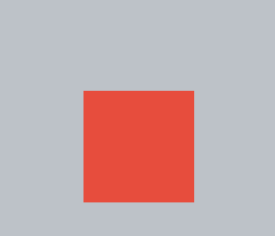
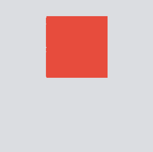

# Interaction and Animation Properties

交互与动画属性

这些设置特定动画和交互，将其应用到图层。动画的范围和交互与动画的关系用来作为判断条件。

These settings are specific to the animations and interactions applied to the layer. These are used to define the conditions, ranges of an animation and interaction/animation relationships.

## Based On

依据

第一个菜单项将动画设置给该图层。图层必须要有一个交互动作，才能在菜单中显示。建议使用简单的图层名称，易于使用。

The first menu sets the layer the animation will be based on. A layer must have an interaction on it for it to show up in this menu. We suggest keeping layer names simple and clear for ease of use.

每个交互动作都有不同的事件，第二个菜单项设置交互的事件到动画上。取决于事件，其他动画属性和选项可用或者被隐藏。

Each interaction has different events and the second menu sets the interaction event the animation is based on. Depending on the event, other animation properties and options will become available or be hidden.

一层有多个交互，应用于它将显示所有可用选项。

A layer that has more than one interaction applied to it will show all options available.

这是交互事件的一个图表：

This is a chart of interaction events:

| 拖动	      |  位置  |  开始	 |  释放  |          |
| ----------- | :---------:| :---------: | :-------: | -------: |
| 点击	      | 点击	   | 	         |           |          |
| 双击         |       双击 |	 	 |           |          |
|长按          | 长按       |             |           |	        | 	
|旋转	      | 旋转        | 开始	 | 释放   |          |
|收缩	      | 收缩	   | 开始	 | 释放   |          | 
|滚动	      | 位置   | 开始	 | 结束	     | 释放  |
|*屏幕*     | 加载	   |             |           |          

| Drag | Position | Start | Release |  |
|------|:--------:|:-----:|:-------:|::|
| Tap | Tap |  |  |  |
| Double Tap | Double Tap |  |  |  |
| Long Press | Long Press |  |  |  |
| Rotate | Rotation | Start | Release |  |
| Pinch | Pinch | Start | Release |  |
| Scroll | Position | Start | End | Release |
| *SCREEN* | Loaded |  |  |  |

请注意，*屏幕*有一个选项，加载，当屏幕加载时，动画根据该选项加载。

Please note, * *SCREEN* * has one option, Loaded, which bases the animation on when the screen loads.

拖拽，旋转，捏拉和滚动中多个事件互动被认为是恒定的，因为用户可以连续进行这种互动。

Interactions with more than one event (Drag, Rotate, Pinch and Scroll) are considered constant because the user can continuously perform this interaction.

## Animates

动画

有三种类型的动画模式，用以改变动画运行的过程。

There are three types of animation modes that change how the animation runs it’s course.

**CONTINUOUSLY TO FINAL VALUE**

像拖动和滚动这种持续的互动，会限制互动和动画范围的。

Layer moves in parallel with constant interactions like Drag and Scroll, but has limits for interaction and animation range.

**CONTINUOUSLY WITH RATE**

像拖动和滚动持续的互动，图层以规定的速度平移（即视差运动）。

Layer moves in parallel with constant interactions like Drag and Scroll, at defined rate. (i.e. parallax movement)

**WITH DURATION TO FINAL VALUE**

条件满足，图层就会连续移动。

Layer moves with duration, once a set condition is met.

某些交互事件只允许特定的动画类型，如下图所示的图表：

Certain interaction events only allow specific animation types, as shown in the chart below:

| 	|持续	|持续写入速率	|写入持续时间|
| ------|:----: | :-----------: |:--------: |
| 位置 | [x] | [x] | [x] |
| 开始 |  |  | [x] |
| 释放 | |  | [x] |
| 结束 |  |  | [x] |
| 单机/双击/长按 |  |  | [x] | 	
| 旋转/收缩 | [x] | [x] | [x] |	

|  | Continuously | Continuously w/ rate | w/ Duration |
|--|--------------|----------------------|-------------|
| Position | [x] | [x] | [x] |
| Start |  |  | [x] |
| Release |  |  | [x] |
| End |  |  | [x] |
| Tap/Double Tap/Long Press |  |  | [x] |
| Rotation/Pinch | [x] | [x] | [x] |

## Anchors (Scale and Rotate)

锚点（缩放和旋转）

缩放和选择以九宫格的中心为原点。选中九宫格中的一个格子，就可以将其设置为动画执行的原点。

The origin of Scale and Rotate animations can be set with this 3x3 grid. Clicking on one of the squares in the grid, sets the anchor for that animation.

缩放动画将从选定的点上下缩放。

Scale animations will scale up and down from the selected point.

旋转动画将绕着选定点旋转。

Rotate animations will pivot around the selected point.

## Transform Style (Rotate)

旋转的变换样式

这变化轴可用于切换动画。在默认情况下只显示 Z 轴领域。点击三维旋转显示 X 和 Y 轴。这允许card-flip类型的动画。

This toggle changes which axes are available for the animations. By default only the Z axis field is shown. Clicking on **3d Rotation** reveals X and Y axes. This allows for card-flip types of animations.

### X ROTATION

X 轴旋转

绕 X 轴旋转图层，若设置为正数，则底部向顶部翻转。

This rotates the layer around the X axis, animating a bottom to top flip with positive numbers.

### Y ROTATION

Y 轴旋转

绕 Y 轴旋转图层，若设置为正数，则左边向右边翻转。

This rotates the layer around the Y axis, animating a left to right flip with positive numbers.

### Z ROTATION

Z 轴旋转

绕Z轴旋转图层，若设置为正数，顺时针旋转。

This rotates the layer around the Z axis, animating a clockwise spin with positive numbers.

## Backside Layer (Rotate)

旋转到背面

这个属性指定使用哪个层作为旋转层的背面。

This property designates which layer to use as the backside of the rotating layer.

一般，如果没有选定图层，就会将当前图层旋转后作为背面图层。为这个属性选择图层，就可以为此图层设置背面。背面图层可以有任意尺寸，应定位到屏幕，要旋转图层的下方。

By default no layer is chosen and the backside of the rotating layer is used. Choosing a layer for this property will make it the backside of the layer. This backside layer can be any size, should be positioned off screen and must be below the rotating layer, in the layer list.

