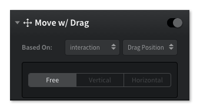

# Interaction Properties

交互属性

交互分为简短的，和连续的。简短交互由一个简单手势动作组成，例如点击。连续的交互允许用户连续触摸屏幕，例如拖拽。

There are two types of interactions, instant and continuous. Instant interactions use a single gesture and are complete on their own, like Tap. Continuous interactions can be manipulated as long as the user maintains contact with the screen, like Drag.

本章节会温习持续交互的可用属性。在 **Pixate** 中短暂交互没有任何的属性，因为交互执行过程是短暂的。

This section will go over the properties available for continuous interactions. Instant interactions don't have any properties in Pixate because they run their course once they're initiated.

## Move with Drag

拖拽

当用户拖拽图层时，在连续触摸屏幕的情况下，可以移动图层。

When a user touches a layer with Drag, they can move that layer around while they maintain contact with the screen.

一般地，拖拽模式设置为 **Free**。意思是图层可以以任意方向拖动。

By default, the Drag is set to **Free**. This means the user can drag the layer in any direction.

切换到 **Vertical** 或者 **Horizontal** 模式，将会限制图层拖动的方向。

Switching to **Vertical** or **Horizontal** displays properties to limit the interaction.

### REFERENCE EDGE

用来定义图层中用于参考的边，可以设置最大值和最小值。

This property is used to define which edge of the layer to use as the reference for the Min and Max positional values (below).

**垂直参数**：

**Vertical options**: 

Top, Vertical Center, Bottom

**水平参数**：

**Horizontal options**: 

Left, Horizontal Center, Right

### MIN AND MAX POSITION

在区域范围内，会对拖拽进行限制，保持图层不越界。

These are the positional limits for the drag. This is how you would keep a layer within the confines of an area.

**垂直**：

**Vertical**: 

Min - how far up 

Max - how far down

**水平**：

**Horizontal**: 

Min - how far left 

Max - how far right

### STRETCH PAST MINIMUM AND MAXIMUM

设置允许用户拖动的最大和最小范围。数值越小，对图层限制越大。

Setting these options allow the user to drag past the minimum and maximum limits. The smaller the number, the more resistance the layer will have past the limits.

## Turn with Rotate

可以使用两个手指旋转图层。为了启动交互，两根手指必须同时触摸图层。

A layer with Rotate can be turned by rotating two fingers on the screen. Both fingers need to touch the layer, in order to initiate the interaction.

### MIN AND MAX ANGLE

设置这些值可以限制用户旋转的角度大小。最小角度是逆时针，最大角度是顺时针。

Setting these values will limit how far the user can rotate the layer. Min angle is counter-clockwise and Max is clockwise.

### STRETCH PAST MINIMUM AND MAXIMUM

设置了用户可以旋转图层比例的极限值。值越小，限制越大。

This sets how far the user can rotate the layer past the defined limits. The smaller the number, the more resistance the rotation will have.

## Resize with Pinch

捏拉改变大小

允许用户使用两根手指捏图层，进行缩放。为了启动交互，两根手指必须同时触摸图层。

Applying Pinch to a layer, allows a user to use two fingers to scale that layer. Both fingers need to touch the layer, in order to initial the interaction.

### MIN AND MAX SCALE

设置了用户缩放图层比例的极限值。比例值越小，缩放越小，反之亦然。

These values limit the multiplier in which the user can scale the layer. Min scale is the smallest it can be scaled and Max is the largest.

### STRETCH PAST MINIMUM AND MAXIMUM

设置了用户缩放图层比例的极限值。比例值越小，限制越大。

This sets how far the user can scale the layer past the limits. The smaller the number, the more resistance.

## Scroll with Drag

拖拽滚动

滚动界面允许用户使用手指轻弹或者拖拽内容。当滚动界面超出边界时，就会over-scroll 反弹，这是IOS 的特色。

Scroll lets a user flick or drag a finger to move through content that sits inside the scrollview. iOS features an over-scroll bounce, that centers the content when a users scrolls beyond its bounds.

### PAGING MODE

设置此分页将提前通过多个内容层,在间隔,当用户是卷轴。

Setting this to paging will snap through multiple content layers, in intervals, as the user is scrolls.

